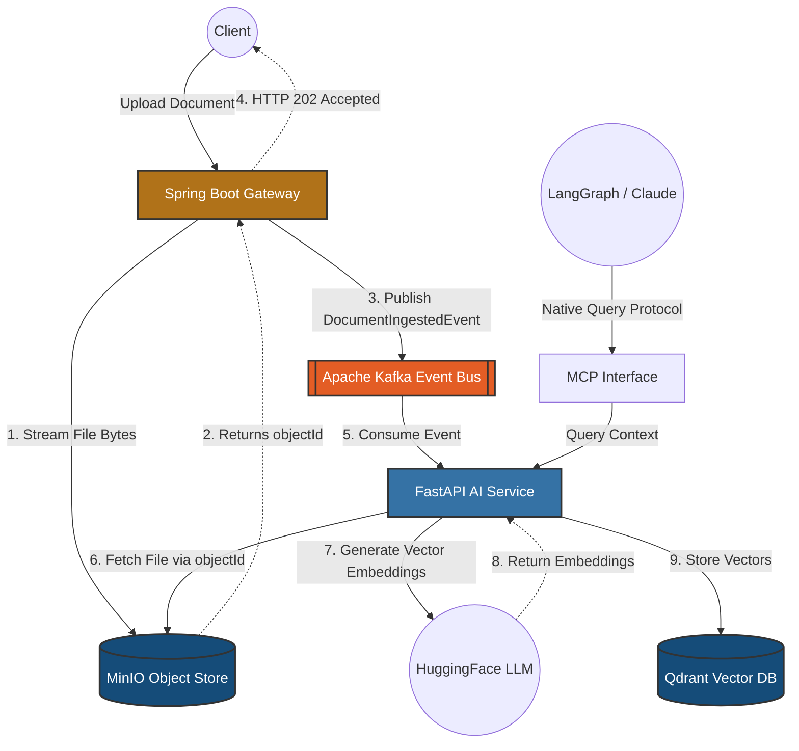

# Project Aegis

**A Distributed Enterprise RAG Engine & Real-Time Context System**

This project demonstrates an event-driven architecture bridging a Java JVM ingestion backend with a Python ML service, designed for high availability, low latency, and heavy data workloads using the Claim Check pattern.

## Architecture Highlights
* **The Heavy Lifter (Java / Spring Boot):** Acts as the API Gateway. Handles massive document uploads (1GB+) using the **Claim Check Pattern**, streaming payloads to MinIO and publishing lightweight events to Apache Kafka.
* **The Tactical Blade (Python / FastAPI):** Dedicated AI Microservice consuming from Kafka, chunking data using LangChain, generating Vector Embeddings locally via HuggingFace, and storing them in a Vector Database.
* **The Interface (MCP Server):** Exposes the semantic search engine via the Model Context Protocol for native integration with LLMs and autonomous LangGraph agents.
* **Enterprise Hardening:** Features distributed tracing (Correlation IDs) and Kafka Dead Letter Queues (DLQ) for zero data loss during extraction failures.

## The Data Lifecycle: How a 1GB File is Processed

A core claim of this architecture is the ability to ingest massive 1GB+ payloads without crashing the system. Here is the exact real-time flow of how that data is handled and stored:

### 1. Ingestion (Bypassing the Heap)
When a 1GB file hits the Spring Boot endpoint, the JVM **does not** load it into memory. It opens an `InputStream` and streams the bytes directly into the MinIO Object Store in 8KB chunks. The heap usage remains flat at ~250MB, meaning the server can handle multiple 1GB uploads concurrently without `OutOfMemory` errors.

### 2. The Event Bus
Once the file is safe in MinIO, Java generates a UUID (`objectId`), attaches a `correlationId` for distributed tracing, and drops a tiny JSON event into Kafka. It instantly returns a `202 Accepted` to the user (usually in under 15ms).

### 3. Extraction & Semantic Chunking
The Python worker pulls the event from Kafka and downloads the 1GB file from MinIO into memory. Using `PyMuPDF`, it extracts the raw text. Because feeding a massive block of text to an LLM destroys context, it uses **LangChain's `RecursiveCharacterTextSplitter`** to intelligently slice the document into 2,000-character chunks while respecting paragraph boundaries.

### 4. Vectorization & Qdrant Storage
Python passes each chunk into a local HuggingFace model (`all-MiniLM-L6-v2`), generating an array of 384 floating-point numbers (the vector). 
It then connects to **Qdrant** and stores two things for every chunk:
* **The Vector:** The 384-dimensional math array used for rapid cosine-similarity searches.
* **The Payload:** The original English text of the chunk, the `correlationId`, and the `objectId`.

### 5. Garbage Collection (MinIO Cleanup)
*Architectural Note:* Once the vectors and the text payload are successfully safely stored in Qdrant, the original 1GB binary file sitting in MinIO is technically redundant for the RAG search process. In a production environment, you would implement a scheduled Cron job or a final step in the Python worker to issue a `DELETE` command to MinIO, purging the original binary file to save hard disk space. 

## Technologies
* **Ingestion Gateway:** Java 21, Spring Boot 3, Spring Kafka
* **Message Broker:** Apache Kafka (KRaft mode)
* **Object Storage:** MinIO (S3 compatible)
* **AI Service:** Python 3.11, FastAPI, HuggingFace, LangChain, LangGraph
* **Vector DB:** Qdrant
* **Deployment:** Docker Compose (Isolated bridge network)

## Architecture Diagram

## How to Run & Test (Infrastructure)

To properly test the architecture, we generate massive dummy payloads to prove the Claim Check pattern handles extreme scale without crashing the JVM memory.

**Step-by-Step Execution:**
Please follow the detailed **[Ingestion Testing Guide](docs/Ingestion_Testing_Guide.md)** located in the `docs` folder. It covers:
1. Spinning up the Docker infrastructure (Kafka, MinIO, Qdrant).
2. Starting the Spring Boot Gateway and Python AI Worker.
3. Using the included `.\scripts\upload_folder.ps1` to batch upload a directory of PDFs.
4. Uploading the payload via `curl` and verifying the millisecond latency.
5. Verifying the semantic chunks and vectors in the Qdrant Dashboard.