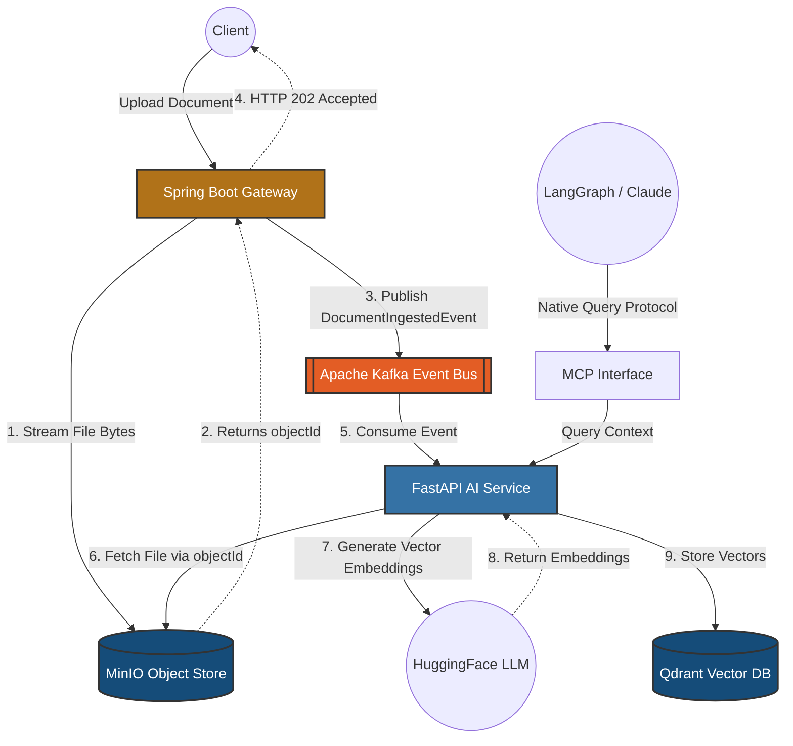

# Aegis

**A Distributed Enterprise RAG Engine & Real-Time Context System**

This project demonstrates an event-driven architecture bridging a Java JVM ingestion backend with a Python ML service. It is designed for high availability, low latency, and heavy data workloads using the **Claim Check pattern**. 

### The Data Flow
1. **Ingestion:** Spring Boot catches massive documents (e.g., 40MB+ PDFs), streams the raw binary directly to MinIO, and publishes an event to Kafka in milliseconds, bypassing JVM heap limits.
2. **Transformation:** A headless Python worker catches the Kafka event, downloads the file, and uses LangChain to intelligently split the text into semantic chunks.
3. **Vectorization:** The Python worker uses a local HuggingFace CPU model to generate 384-dimensional mathematical vectors for every chunk.
4. **Storage & Cleanup:** The vectors and textual metadata are safely stored in **Qdrant**, and the raw binary file is garbage-collected (deleted) from MinIO to prevent cloud storage bloat.

## Architecture Diagram


## Technologies
* **Ingestion Gateway:** Java 21, Spring Boot 3, Spring Kafka
* **Message Broker:** Apache Kafka (KRaft mode)
* **Object Storage:** MinIO (S3 compatible)
* **AI Service:** Python 3.11, FastAPI, HuggingFace, LangChain, LangGraph
* **Vector DB:** Qdrant
* **Deployment:** Docker Compose (Isolated bridge network)

## 📚 Documentation & Deep Dives

To keep this README concise, all detailed system mechanics, testing guides, and engineering trade-offs have been modularized. Please explore the links below:

* 🏛️ **[Architecture Decision Records (ADR)](docs/ARCHITECTURE.md)** 
  * *Read this to understand the "Why".* Covers the trade-offs of I/O vs CPU decoupling, why we used LangChain over naive chunking, Qdrant over PostgreSQL, and our DLQ/Tracing fault-tolerance strategy.
* 🧪 **[Testing & Ingestion Guide](docs/End_to_End_Testing_Guide.md)** 
  * *Read this to run the code.* Step-by-step instructions for spinning up the Docker cluster and using the batch scripts (`.ps1` and `.sh`) to ingest your own PDF books or codebase into the vector engine.
* 📝 **[Engineering Blog Series](blogs/)** 
  * *Read this for production war stories.* Deep dives into how we dropped API latency from 32s to 12ms, and how we solved a 62MB JSON payload bug caused by binary escaping.

## Quick Start (Local Cluster)

1. Spin up the infrastructure (Kafka, MinIO, Qdrant):
   ```bash
   docker-compose up -d
   ```
2. Follow the **[Testing Guide](docs/End_to_End_Testing_Guide.md)** to start the Java and Python microservices and batch-upload your documents.