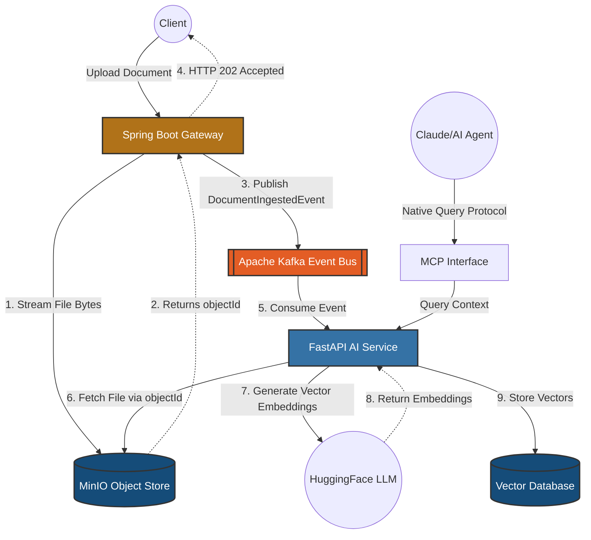

# Project Aegis (ContextStream)

**A Distributed Enterprise RAG Engine & Real-Time Context System**

Aegis is a high-throughput, real-time event processing system designed to ingest massive amounts of data (documents, logs, etc.), semantically index them on the fly, and expose this "living memory" to AI agents using the Model Context Protocol (MCP).

This project demonstrates a Staff-level architecture bridging a heavy Java JVM backend with a high-speed Python ML service, designed for high availability, low latency, and heavy data workloads.

## Architecture Highlights
* **The Heavy Lifter (Java / Spring Boot):** Acts as the API Gateway and Orchestrator. Handles massive document uploads using the **Claim Check Pattern**, streaming payloads to MinIO and publishing lightweight events to Apache Kafka.
* **The Tactical Blade (Python / FastAPI):** (Upcoming) Dedicated AI Microservice consuming from Kafka, chunking data, generating Vector Embeddings, and storing them in a Vector Database.
* **The Interface (MCP Server):** (Upcoming) Exposes the semantic search engine via the Model Context Protocol for native integration with LLMs like Claude.

## Technologies
* **Ingestion Gateway:** Java 17, Spring Boot 3, Spring for Apache Kafka
* **Message Broker:** Apache Kafka (KRaft mode)
* **Object Storage:** MinIO (S3 compatible)
* **AI Service (WIP):** Python, FastAPI, HuggingFace/SentenceTransformers
* **Vector DB (WIP):** pgvector / Qdrant
* **Deployment:** Docker, Docker Compose

## Architecture Diagram


## Modules

### Phase 1: The Enterprise Backbone (Ingestion & Streaming)
* Implemented a Spring Boot microservice acting as the ingestion gateway.
* Utilizes the **Claim Check Pattern** to handle large file uploads without blocking threads or crashing the JVM.
* Files are streamed directly to MinIO, and a lightweight `DocumentIngestedEvent` is published to a Kafka topic (`aegis.documents.raw`).

### Phase 2: The AI Brain (Real-Time Processing & MCP) - *In Progress*
* FastAPI service consuming the Kafka stream in real-time.
* Real-time vector indexing and protocol-driven design (MCP).

### Phase 3: High Availability & Deployment - *Upcoming*
* Full container orchestration, fault tolerance, and system observability.

## How to Run (Infrastructure)

1. Start the infrastructure (Kafka, MinIO):
   ```bash
   docker-compose up -d
   ```
2. Start the Spring Boot Gateway:
   ```bash
   cd aegis-ingestion-gateway
   ./mvnw spring-boot:run
   ```
3. Test a large upload:
   ```bash
   curl -X POST -F "file=@docker-compose.yml" http://localhost:8080/api/v1/documents
   ```
